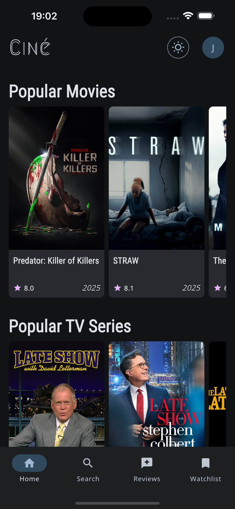
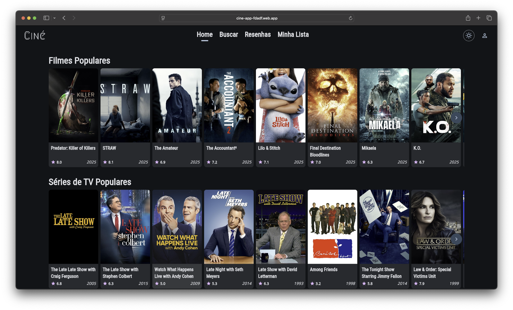
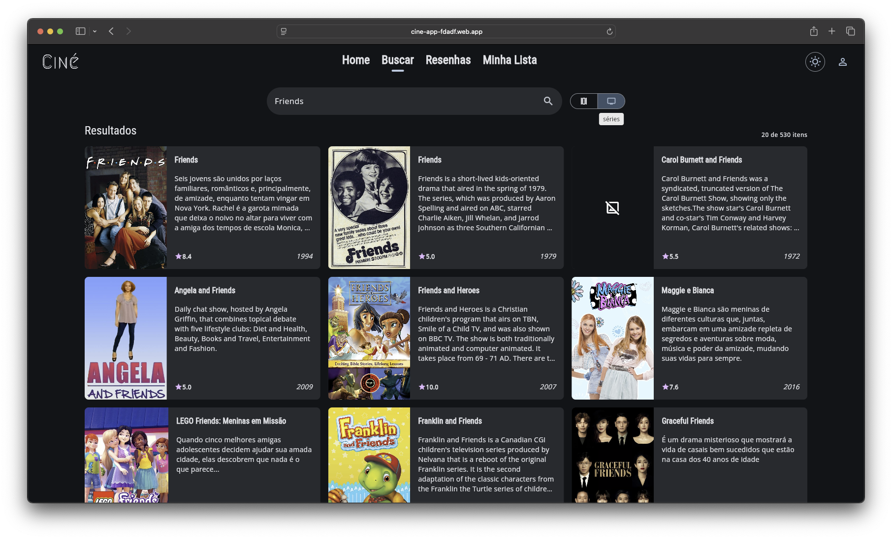
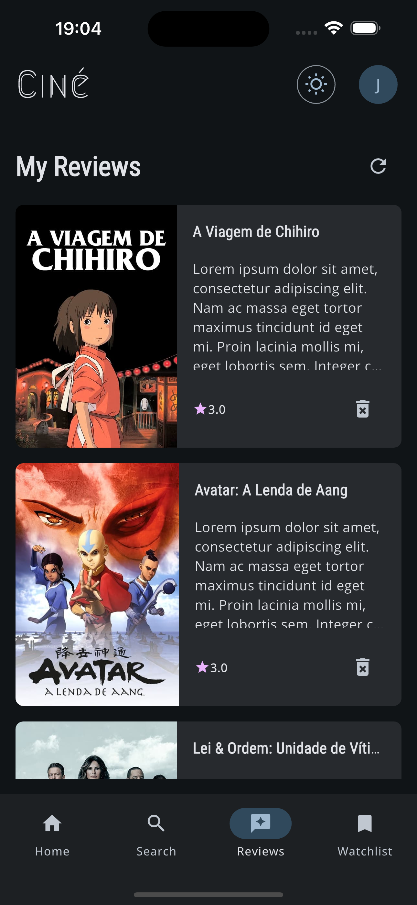
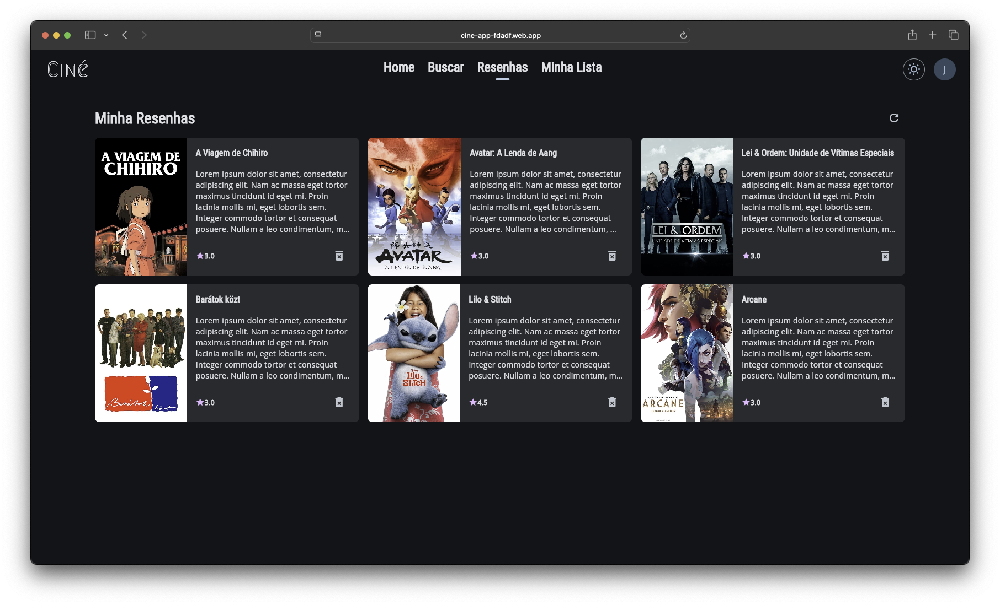
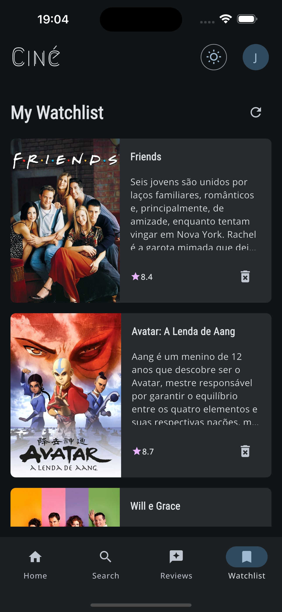
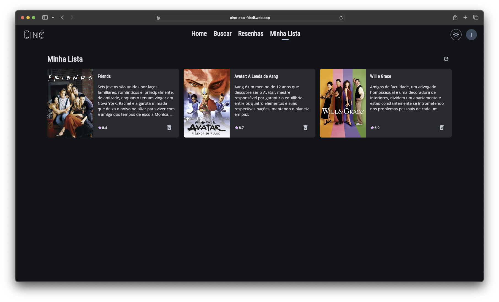
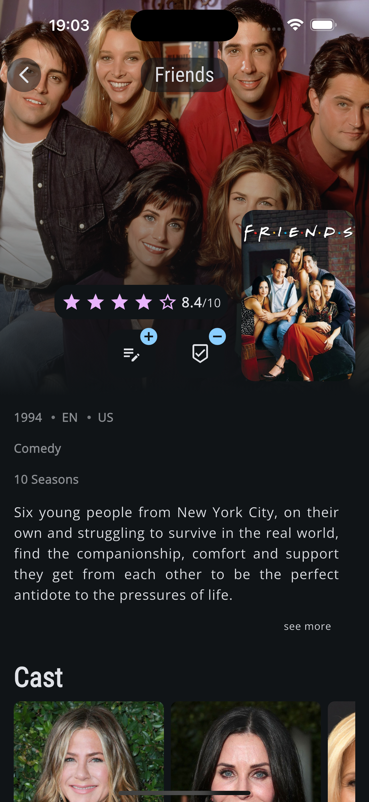
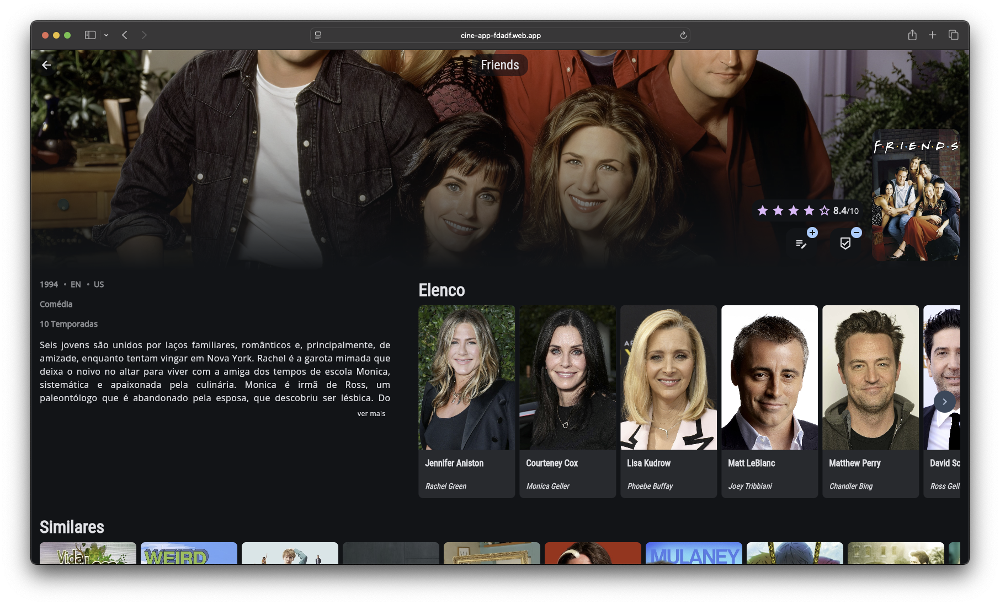

# 🎬 Ciné — Flutter Movie & TV Series App

> Uma aplicação *responsiva*, *adaptativa* e *multiplataforma* desenvolvida com Flutter + Clean Architecture, voltada para consulta de filmes e séries, com funcionalidades sociais privadas.

## 🎥 Demonstração

<p align="center">
  
</p>

> Uma prévia da navegação pelo app Ciné nas versões mobile e web.

## 📱 Sobre o projeto

**Ciné** é uma aplicação desenvolvida com o objetivo de explorar boas práticas de arquitetura e desenvolvimento com Flutter, destacando-se por:

- ✅ Interface **responsiva**: se ajusta automaticamente a diferentes tamanhos de tela (mobile, tablet, desktop e web)
- ✅ Comportamento **adaptativo**: adapta-se ao tipo de plataforma com UX específica
- ✅ Modularização eficiente
- ✅ Uso mínimo de bibliotecas externas
- ✅ Design limpo e orientação à manutenibilidade

O app permite:

- 🔎 Buscar por filmes e séries de TV via API do [TMDB](https://www.themoviedb.org/)
- 🎞️ Visualizar detalhes completos, como sinopse, elenco e produções similares
- 📝 Adicionar resenhas pessoais e montar uma watchlist
- 🔐 Salvar informações de forma privada com autenticação via **Firebase Auth** e persistência no **Firestore**

---

## 🧱 Estrutura do Projeto

O projeto é organizado em módulos reutilizáveis e desacoplados:

```text
├── app/                 # Camada de apresentação e lógica específica da aplicação
├── core/                # Modelos, utilitários, contratos e integrações genéricas
├── design_system/       # Componentes visuais reutilizáveis e temas responsivos
├── internationalization/# Suporte a internacionalização e localização
```
---

## 🧠 Tecnologias e Arquitetura

- ✅ **Flutter** (multiplataforma: mobile, web, desktop)
- ✅ **UI responsiva e adaptativa**
- ✅ **Clean Architecture** com **MVVM**
- ✅ **Firebase Auth & Firestore** para autenticação e dados privados
- ✅ **TMDB API** para dados de filmes e séries
- ✅ **Gerenciamento de estado** com `ChangeNotifier` e `setState` (em casos simples)
- ✅ **GoRouter** para navegação
- ✅ **Provider** para injeção de dependência
- ✅ **Padrões Command e Result** para encapsulamento da lógica
  
---

## 📸 Galeria Responsiva

> Abaixo, capturas de tela demonstrando como a interface do app se adapta entre dispositivos **mobile** e **web**.

---

### 🏠 Home

<p float="left">
  
  
</p>

---

### 🔍 Search

<p float="left">
  
  
</p>

---

### 📝 Reviews

<p float="left">
  
  
</p>

---

### 📺 Watchlist

<p float="left">
  
  
</p>

---

### 📄 Details

<p float="left">
  
  
</p>

---

> 💡 As imagens acima mostram como o app se adapta de forma fluida entre diferentes tamanhos de tela, mantendo uma boa experiência.

---

## 🚀 Como executar

### 🔗 Acesse online

Você pode testar a versão Web diretamente pelo link:

👉 [https://cine-app-fdadf.web.app](https://cine-app-fdadf.web.app/)

---

