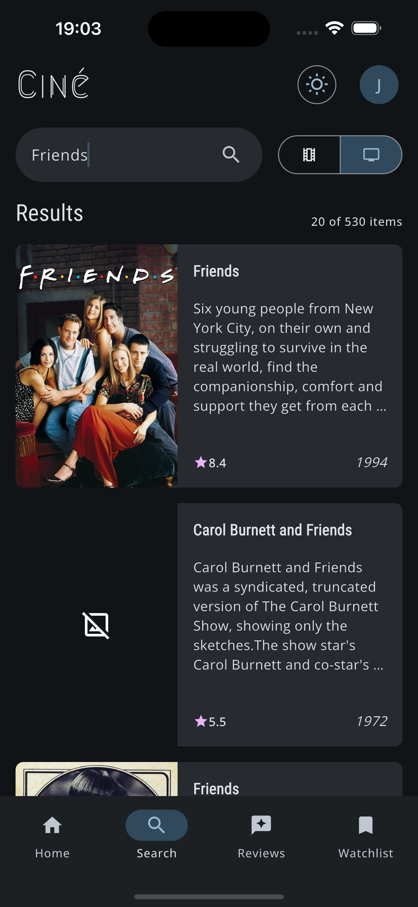

# 🎬 Ciné — Flutter Movie & TV Series App

> Uma aplicação *responsiva*, *adaptativa* e *multiplataforma* desenvolvida com Flutter + Clean Architecture, voltada para consulta de filmes e séries, com funcionalidades sociais privadas.

## 🎥 Demonstração

<p align="center">
  
</p>

> Uma prévia da navegação pelo app Ciné nas versões mobile e web.

## 📱 Sobre o projeto

**Ciné** é uma aplicação desenvolvida com o objetivo de explorar boas práticas de arquitetura e desenvolvimento com Flutter, destacando-se por:

- ✅ Interface **responsiva**: se ajusta automaticamente a diferentes tamanhos de tela (mobile, tablet, desktop e web)
- ✅ Comportamento **adaptativo**: adapta-se ao tipo de plataforma com UX específica
- ✅ Modularização eficiente
- ✅ Uso mínimo de bibliotecas externas
- ✅ Design limpo e orientação à manutenibilidade

O app permite:

- 🔎 Buscar por filmes e séries de TV via API do [TMDB](https://www.themoviedb.org/)
- 🎞️ Visualizar detalhes completos, como sinopse, elenco e produções similares
- 📝 Adicionar resenhas pessoais e montar uma watchlist
- 🔐 Salvar informações de forma privada com autenticação via **Firebase Auth** e persistência no **Firestore**

### 📚 Sobre a API do TMDB
O aplicativo utiliza a API do The Movie Database (TMDB) para obter dados públicos de filmes e séries, utilizados nas principais funcionalidades de navegação e descoberta de conteúdo. 

Na tela inicial, o app exibe listagens de filmes e séries, consumindo os seguintes endpoints:
1. Filmes populares `(/movie/popular)`;
2. Séries populares `(/tv/popular)`;
3. Filmes mais bem avaliados `(/movie/top_rated)`;
4. Séries mais bem avaliadas `(/tv/top_rated)`. 

> Essas chamadas retornam listas paginadas contendo informações básicas como título ou nome, imagem de poster, data de lançamento ou estreia, nota média e identificador do item.

O aplicativo também permite a busca de conteúdos por meio dos endpoints:
1. Pesquisa de filmes `(/search/movie)`;
2. Pesquisa de séries de TV `(/search/tv)`;

> Os resultados retornam dados suficientes para exibição em listas e acesso à tela de detalhes.

Ao selecionar um item, o app consome os endpoints de detalhes:
1. Detalhes de filmes `(/movie/{movie_id})`;
2. Detalhes de séries de TV `(/tv/{tv_id})`;
3. Conteúdos similares `(/movie/{movie_id}/similar)` ou `(/tv/{tv_id}/similar)`;
4. Créditos `(/movie/{movie_id}/credits)` ou `(/tv/{tv_id}/credits)`;


> Esses endpoints retornam informações mais completas como sinopse, gêneros, avaliação, idioma original, imagens de capa e fundo e elenco principal.

---
## 🚀 Como executar

### 💻 Executando localmente

#### Antes de começar, você precisa ter:

- Flutter SDK instalado
- Um editor (VS Code ou Android Studio)
- Uma conta no Firebase
- Uma conta no The Movie Database (TMDB) para obter uma API Key

#### Pré-requisitos:

#### 1. Configure o Firebase:
1. Acesse o Firebase Console e crie um novo projeto;
2. Ative os serviços de autenticação (Firebase Authentication com email e senha) e banco de dados (Firestore);
3. Se for um usuário Android, adicione um app android no Firebase, baixe o arquivo `google-services.json` e coloque-o na pasta app/android/app;
4. Se for um usuário iOS, adicione um app ios no Firebase, baixe o arquivo `GoogleService-Info.plist` e coloque-o na pasta app/ios/Runner;

#### 2. Crie uma API Key e um Token do TMDB:
1. Acesse: https://www.themoviedb.org/;
2. Crie uma conta e obtenha uma API Key e um Token;
3. No módulo app, adicione um .env com as variáveis de ambiente abaixo:
```
TMDB_API_KEY=SEU_TMDB_API_KEY
TMDB_API_TOKEN=SEU_TMDB_API_TOKEN
```

#### 3. Instale o Melos:
1. No terminal, realize a ativação do melos:
    ```
    dart pub global activate melos
    ```
2. Na raiz do projeto, execute:
    ```
    melos bootstrap
    ```
3. Caso precise, execute o pub get em todos os módulos:
   ```
   melos pub:get
   ```

#### Passo a passo:

1. Clone o repositório:
    ```
    git clone https://github.com/jorgednts/movie_review_app.git
    ```

2. Entre na pasta App do projeto:
    ```
    cd app
    ```
3. Execute o projeto utilizando o seu TMDB Token:
   ```
   flutter run --dart-define=TMDB_API_TOKEN=SEU_TMDB_API_TOKEN
   ```

### 🤖 Via APK

Você pode baixar instalar o APK num dispositivo Android através do link abaixo:

👉 [https://drive.google.com/file/d/1P3VonKKLkyoGORBMWNmimC_YHqjLe1BV/view?usp=sharing](https://drive.google.com/file/d/1P3VonKKLkyoGORBMWNmimC_YHqjLe1BV/view?usp=sharing)


### 🔗 Acesse online

Você pode testar a versão Web diretamente pelo link:

👉 [https://cine-app-fdadf.web.app](https://cine-app-fdadf.web.app/)

---

## 🧱 Estrutura do Projeto

O projeto é organizado em módulos reutilizáveis e desacoplados:

```text
├── app/                 # Camada de apresentação e lógica específica da aplicação
├── core/                # Modelos, utilitários, contratos e integrações genéricas
├── design_system/       # Componentes visuais reutilizáveis e temas responsivos
├── internationalization/# Suporte a internacionalização e localização
```

> 🎨 Design System & Widgetbook
> O projeto conta com um Design System dedicado, centralizado no módulo design_system, onde estão definidos componentes reutilizáveis, temas e estilos visuais. Para garantir consistência visual, previsibilidade de comportamento e qualidade da UI, os componentes são desenvolvidos e validados de forma isolada utilizando o Widgetbook, permitindo visualizar variações, estados e responsividade sem dependência da aplicação principal.
---

## 🧠 Tecnologias e Arquitetura

- ✅ **Flutter** (multiplataforma: mobile, web, desktop)
- ✅ **UI responsiva e adaptativa**
- ✅ **Clean Architecture** com **MVVM**
- ✅ **Firebase Auth & Firestore** para autenticação e dados privados
- ✅ **TMDB API** para dados de filmes e séries
- ✅ **Gerenciamento de estado** com `ChangeNotifier` e `setState` (em casos simples)
- ✅ **GoRouter** para navegação
- ✅ **Provider** para injeção de dependência
- ✅ **Padrões Command e Result** para encapsulamento da lógica
- ✅ **Widgetbook** para desenvolvimento, documentação e validação isolada da UI

> 🎨 O uso do Widgetbook reforça o cuidado com consistência visual, reutilização de componentes e qualidade da experiência do usuário, alinhado a práticas comuns em times de Design System.
  
---

## 📸 Galeria Responsiva

> Abaixo, capturas de tela demonstrando como a interface do app se adapta entre dispositivos **mobile** e **web**.

---

### 🏠 Home

<p float="left">
  
  
</p>

---

### 🔍 Search

<p float="left">
  
  
</p>

---

### 📝 Reviews

<p float="left">
  
  
</p>

---

### 📺 Watchlist

<p float="left">
  
  
</p>

---

### 📄 Details

<p float="left">
  
  
</p>

---

> 💡 As imagens acima mostram como o app se adapta de forma fluida entre diferentes tamanhos de tela, mantendo uma boa experiência.

---